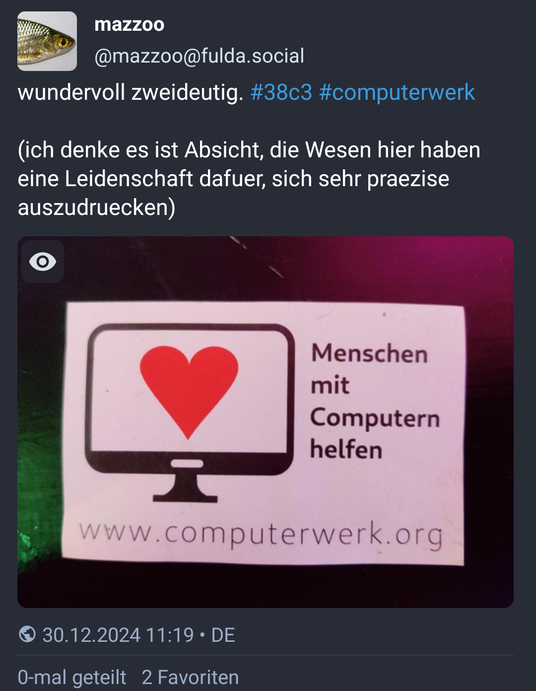

# Introduction

## Quick facts

* released 1887 by L. L. Zamenhof, Poland (at the time occupied by Russia)
* number of speakers; $10^3$ natives, $10^5$ fluent regulars, $10^6$ "started
  to learn"
* language code: *eo*, *epo* (lots of localized software: wordpress, hunspell, …)

* phonetic alphabet
* ⅔ of word roots are Romanic, ⅓ Germanic (also some Slavic, acient Greek, Hebrew)
* simplistic grammar

## Sample text

Ni venis al Hamburgo antaŭ tri tagoj por partopreni la kongreson de la
ĥaoskomputila klubo. Estas nia 8a tia kongreso kaj ni ege ĝuas ĝin. Ni eĉ havas
nian propran asembleon kun interesa LED-instalaĵo. Bedaŭrinde estas jam la
lasta tago de la kongreso, do ni ĉi-vespere jam devas forveturi.

# Alphabet and phonetics

## Rules

* bijective mapping between spelling and phonetics
* stress on second last syllable
* exactly one syllable for every vowel
* no long or short vowels

## The alphabet

Straight forward latin alphabet with the following quirks

* no "w" – "v" is used instead (Vindozo)
* no "x" – "ks" is used instead (Linukso)
* no "y" – "i" is used instead
* "c" is like the german "z", "z" is like the english "z"

---

Some special characters

* ŝ – like english "sh" like in "fish"
* ĉ - like the "ch" in english "ouch"
* ĝ – like the "j" in english "jungle"
* ĵ - like the "J" in *german* "Jounalist"
* ĥ - like the "ch" in german "Bach"
* ŭ – like "u" half vowel

The letters "j" ans "ŭ" are so called *half vowels*, that means they don't have
a syllable on their own but form a diphthong.

# Some grammar basics

## Personal pronouns

singular:

* mi
* vi
* li/ŝi/ĝi/oni

plural:

* ni
* vi
* ili

## Verbs

Verb endings

* Infinitive: *-i* (esti, nomiĝi, plaĉi)
* Present tense: *-as* (estas, nomiĝas, plaĉas)
* Past tense: *-is* (estis, nomiĝis, plaĉis)
* Future tense: *-os* (estos, nomiĝos, plaĉos)
* Conditional tense: *-us* (estus, nomiĝus, plaĉus)
* Imperative: *-u* (estu, nomiĝu, plaĉu)

vidi, aŭdi, ami, manĝi, trinki, drinki, …

Mi amas vin. – Ni trinkas ĉunkon. – Ili manĝas picon.

## Nouns

* *-o* (kongreso, kurso, lingvo, tablo, seĝo, fenestro, pomo, …)
* plural: *-j* (kongresoj, kursoj, lingvoj, tabloj, seĝoj, fenestroj, pomoj, …)

## Adjectives

* *-a* (bela, granda, ruĝa, verda, kongresa, dolĉa, plaĉa)
* plural: *-j* (belaj, grandaj, ruĝaj, verdaj, kongresaj, dolĉaj, plaĉaj)

Hamburgo estas granda urbo. – Hamburgo estas bela.

## Derived adverbs

* *-e* (bele, grande, ruĝe, verde, kongrese, dolĉe, plaĉe)

La kanto estas bel*a* kaj ŝi bel*e* kantis ĝin.

## Yes/No questions

* **Ĉu** vi ŝatas la kongreson?
* *Jes*, mi ŝatas la kongreson. / *Ne*, mi ne ŝatas la kongreson.

## Accusative

*-n*

Marks the direct object. Examples:

* Mi amas vi*n*
* Ĉu vi ŝatas la kongreso*n*?
* Ŝi manĝas dolĉaj*n* pomoj*n*.

Can also do other things, e.g. indicate direction instead of location:

* Mi dancas en la dancejo. — I am dancing in the dancing room.
* Mi dancas en la dancejon. — I am dancing **into** the dancing room.

## Esperanto avoids ambiguities

:::::::::::::: {.columns}
::: {.column width="40%"}
{#id .class width=100% height=auto;}
:::
::: {.column width="60%"}
* Homoj *kun* komputiloj helpas.
* Homoj *per* komputiloj helpas.
* Homoj**n** *kun* komputiloj helpi
* Homoj**n** *per* komputiloj helpi
:::
::::::::::::::

## Affixes

* *-eg-*: granda → grand*eg*a — big → huge
* *mal-*: granda → *mal*granda – big → small

Hamburgo estas grandega urbo. – Püttlingen estas malgranda urbo.

## The power of affixes

|        |         | -in-       | vir-        | -id-       | -ar-       | -ej-       | -ist-       |
|:-------|:--------|:-----------|:------------|:-----------|:-----------|:-----------|:------------|
|        |         | *female*   | *male*      | *offspring*| *group*    | *place*    | *profession*|
| ŝafo   | *sheep* | ŝaf*in*o   | *vir*ŝafo   | ŝaf*id*o   | ŝaf*ar*o   | ŝaf*ej*o   | ŝaf*ist*o   |
| hundo  | *dog*   | hund*in*o  | *vir*hundo  | hund*id*o  | hund*ar*o  | hund*ej*o  | hund*ist*o  |
| bovo   | *cow*   | bov*in*o   | *vir*bovo   | bov*id*o   | bov*ar*o   | bov*ej*o   | bov*ist*o   |
| ĉevalo | *horse* | ĉeval*in*o | *vir*ĉevalo | ĉeval*id*o | ĉeval*ar*o | ĉeval*ej*o | ĉeval*ist*o |

---

|        |         | -il-       | -ej-       | -ist-        | -ind-       | -em-       | -ul-         |
|:-------|:--------|:-----------|:-----------|:-------------|:------------|:-----------|:-------------|
|        |         | *tool*     | *place*    | *profession* | *worth*     | *inclined* | *person*     |
| lerni  | *learn* | lern*il*o  | lern*ej*o  | lern*ist*o   | lern*ind*a  | lern*em*a  | lernem*ul*o  |
| manĝi  | *eat*   | manĝ*il*o  | manĝ*ej*o  | manĝ*ist*o   | manĝ*ind*a  | manĝ*em*a  | manĝem*ul*o  |
| muziko | *music* | muzik*il*o | muzik*ej*o | muzik*ist*o  | muzik*ind*a | muzik*em*a | muzikem*ul*o |
| naĝi   | *swim*  | naĝ*il*o   | naĝ*ej*o   | naĝ*ist*o    | naĝ*ind*a   | naĝ*em*a   | naĝem*ul*o   |
| haki   | *hack*  | hak*il*o   | hak*ej*o   | hak*ist*o    | hak*ind*a   | hak*em*a   | hakem*ul*o   |

## Correlatives

|     |             | k-   | t-   | ĉ-    | nen-   |
|:----|:------------|:-----|:-----|:------|:-------|
|     |             | ?    | !    | *all* | *none* |
| io  | *what*      | kio  | tio  | ĉio   | nenio  |
| iu  | *which*     | kiu  | tiu  | ĉiu   | neniu  |
| ia  | *what kind* | kia  | tia  | ĉia   | nenia  |
| iel | *how*       | kiel | tiel | ĉiel  | neniel |
| ie  | *where*     | kie  | tie  | ĉie   | nenie  |
| iam | *when*      | kiam | tiam | ĉiam  | neniam |
| ial | *why*       | kial | tial | ĉial  | nenial |
| iom | *how much*  | kiom | tiom | ĉiom  | neniom |
| ies | *whose*     | kies | ties | ĉies  | nenies |

ĉio – everything · nenie – nowhere · ĉiel – in any way · iel – somehow

## Some important "small" words

* kaj – and
* aŭ – or
* la – *definite article*
* al – to
* de – from/of
* ke – that *(as a conjunction, **not** as pronoun)*
* en – in
* el – out (of)
* da – of *(to indicate a quantity)*
* kun – with · sen – without
* …

## Participles

|         | present | past  | future |
|---------|---------|-------|--------|
| active  | -ant-   | -nt- | -ont-  |
| passive | -at-    | -it   | -ot-   |

La pas*int*a kongreso okazis en 2023.

La ven*ont*a kongreso okazos en 2025.

La kongreso estas bone organiz*it*a.

# Resources

## Learning

* [Duolingo](https://www.duolingo.com/course/eo/en)
* [lernu](https://lernu.net)
* [Wikipedia in Esperanto](https://eo.wikipedia.org)
* [Online dictionary (multilingual)](https://reta-vortaro.de)
* [Online dictionary](https://vortaro.net)

## Groups

* [Telegram](https://telegramo.org)
* [reddit](https://reddit.com/r/esperanto)
* [StackExchange](https://esperanto.stackexchange.com)
* [Mastodon instance](https://esperanto.masto.host)
* [Amikumu](https://amikumu.com) – an app to meet Esperanto speakers nearby
* [Pasporta servo](https://pasportaservo.org) – a kind of Esperanto couch surfing

## Music

* [Awesome Esperanto music videos](https://www.youtube.com/playlist?list=PLLg4HNcQo8zx3IMEXcrnRCkEhyXWDDf37)
* [Vinilkosmo – Music label](https://www.vinilkosmo-mp3.com/en/)
* [Song lyrics](http://kantaro.ikso.net/)
* [Eternan lumon - Jonny M - Album "Regestilo"](https://www.youtube.com/watch?v=8J9jz9VpUsI)
* [Samideano - ETERNE RIMA (Tokio/Tokyo)](https://www.youtube.com/watch?v=PrHU_lICydA)
* [Abatejo – Amon mi bezonas](https://www.youtube.com/watch?v=dA-WdEcMacw)
* [Martin kaj la talpoj - Gefratoj](https://www.youtube.com/watch?v=EeXMv_94A_U)
* [i.d.c. - La fina venk'](https://www.youtube.com/watch?v=qJUYODkEr-o)
* [i.d.c. - Tatua papili'](https://www.youtube.com/watch?v=CXMbOKc93wY)
* [i.d.c. - Berlino sen vi](https://www.youtube.com/watch?v=530Y4a6jomI)
* [i.d.c. – La nokta stirado](https://www.youtube.com/watch?v=DNjsx8xjdC0)
* [LPG - La Kosma Aventuro](https://www.youtube.com/watch?v=fGPlcWsfZgs)
* [Supernova - La postrompiĝa temp'](https://www.youtube.com/watch?v=PWeqykF7A_U)
* [Gijom - La postrompiĝa temp'](https://www.youtube.com/watch?v=-XiqpAjPd8A)
* [Gijom - Kortuŝa Eksces'](https://www.youtube.com/watch?v=WencRDLDJVY)

## Videos podcasts etc.

* [Studio](http://novajhoj.weebly.com/)
* [kern.punkto](https://kern.punkto.info) – our own podcast
* [Esperanto natives](https://www.youtube.com/watch?v=UzDS2WyemBI)
* [TEJO Esperanto](https://www.youtube.com/channel/UC1cW8y4NncmbRr6zD5IO8xw/videos)

## Congresses, meetups (small selection)

* [Esperanto world
  congress](https://en.wikipedia.org/wiki/World_Esperanto_Congress)
* [International Youth
  Congres](https://en.wikipedia.org/wiki/International_Youth_Congress)
* [Esperanto summer studies](https://ses.ikso.net)
* [Esperanto youth week](http://jes.pej.pl)

# Follow up …

## … further discussion at the congress

* Meet us at our assembly
* Contact us [@evaf@mastodon.art](https://mastodon.art/@evaf),
  [@johmue@chaos.social](https://chaos.social/deck/@johmue)
* … or toot to `#38c3eo`

---

Koran dankon – Thank you very much

{ width=25em, height=25em }
